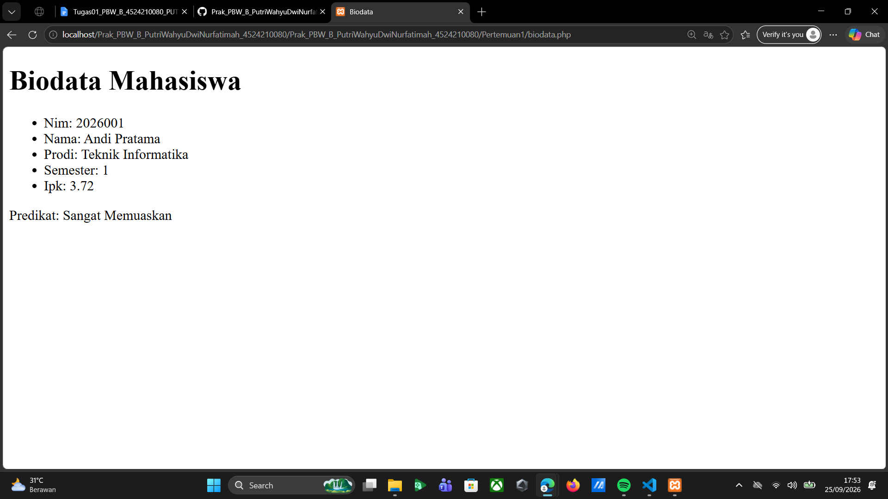
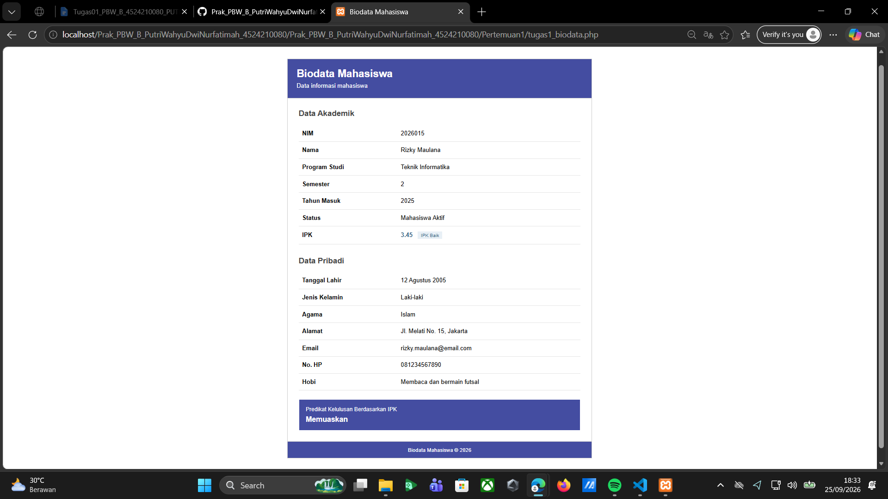
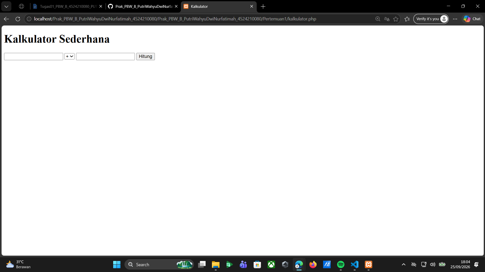
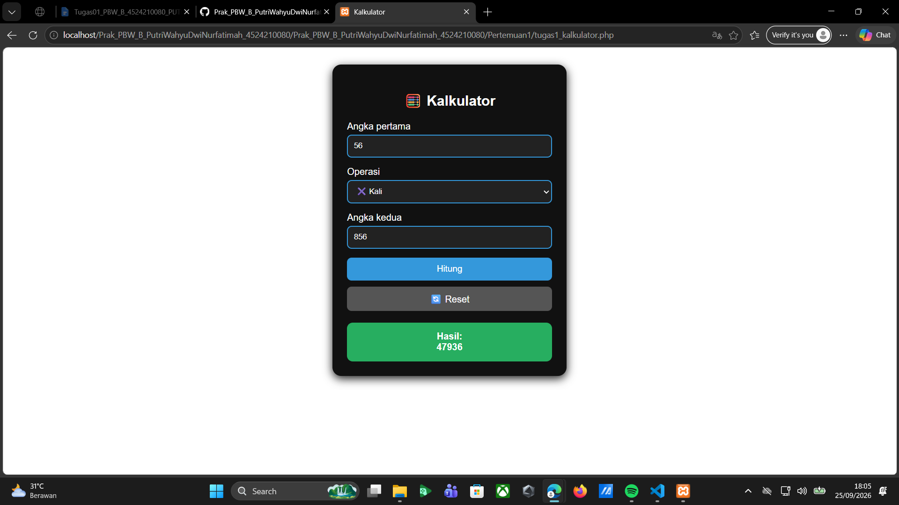

**Tugas 01 - Prak. Pemrograman Berbasis Web - B**

**Biodata Mahasiswa**

Program Biodata Mahasiswa dibuat menggunakan PHP untuk menampilkan informasi mahasiswa, seperti NIM, nama, program studi, semester, tahun masuk, data pribadi, kontak, hobi, status, dan IPK. Program ini juga menggunakan fungsi statusKelulusan() untuk menentukan predikat berdasarkan nilai IPK serta fungsi kategoriIPK() sebagai tambahan untuk memberikan kategori nilai IPK.

Pada program biodata dilakukan beberapa modifikasi, yaitu menambahkan data mahasiswa yang lebih lengkap, menambahkan kategori IPK, serta memperbaiki tampilan menggunakan CSS agar informasi tersusun lebih rapi. Tampilan program juga dibuat responsif sehingga dapat menyesuaikan ukuran layar.

*Screenshot Biodata Sebelum Modifikasi:*

*Screenshot Biodata Sesudah Modifikasi:*

**Kalkulator**

Program Kalkulator dibuat menggunakan PHP untuk melakukan operasi matematika berdasarkan dua angka yang dimasukkan oleh pengguna. Program awal menyediakan operasi penjumlahan, pengurangan, perkalian, dan pembagian serta memiliki pengecekan untuk mencegah pembagian dengan angka nol.

Pada program kalkulator dilakukan beberapa modifikasi, yaitu menambahkan operasi pangkat dan sisa bagi, menambahkan validasi ketika input angka belum diisi, serta memperbaiki tampilan menggunakan CSS. Selain itu, ditambahkan tombol reset untuk mengembalikan kalkulator ke kondisi awal.

*Screenshot Kalkulator Sebelum Modifikasi:*

*Screenshot Kalkulator Sesudah Modifikasi:*

**Error yang Pernah Muncul**

Salah satu error yang dapat muncul pada program kalkulator adalah ketika pengguna melakukan pembagian dengan angka nol. Hal tersebut ditangani dengan menambahkan kondisi pengecekan $b == 0, sehingga program akan menampilkan pesan bahwa pembagian dengan nol tidak diperbolehkan dan tidak melanjutkan proses perhitungan.