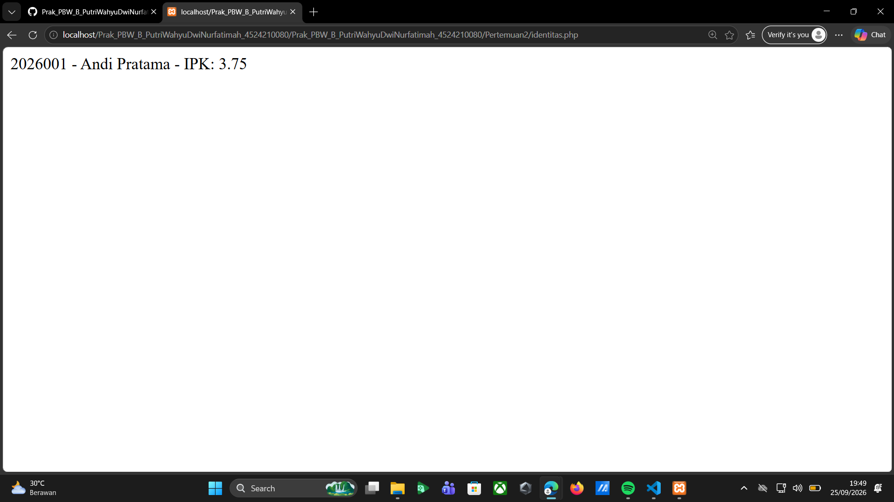
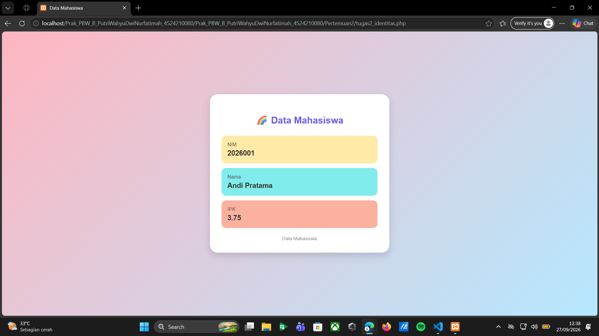
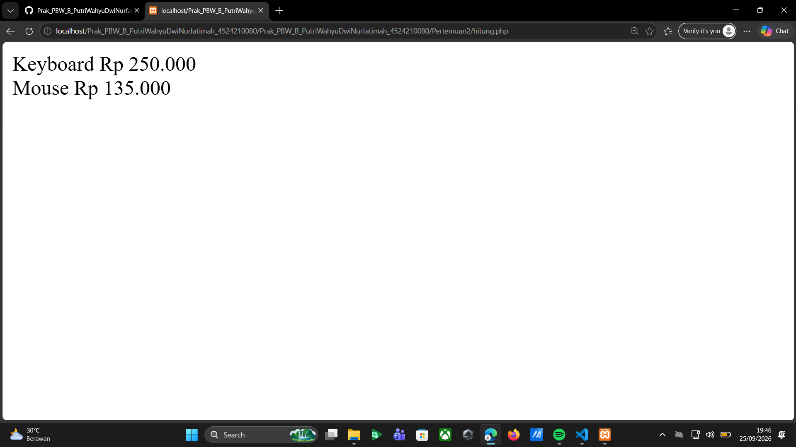
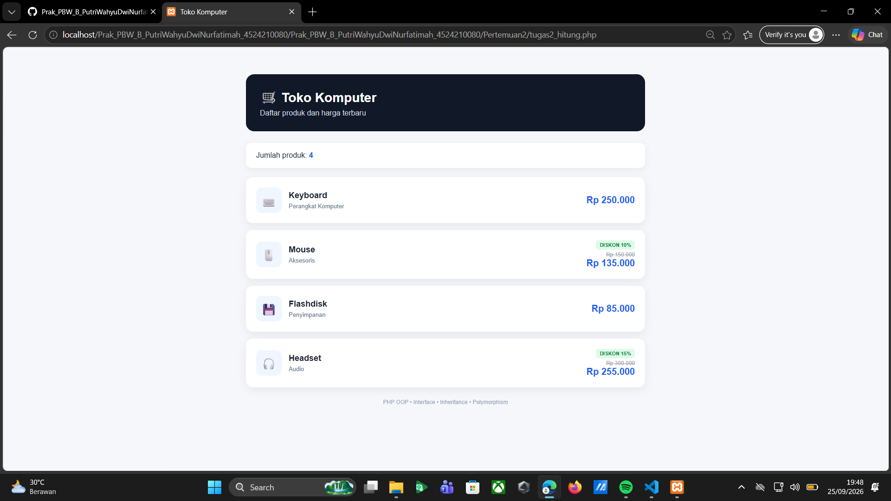

**Tugas 02 - Prak. Pemrograman Berbasis Web - B**

**Identitas Mahasiswa**

Program Identitas Mahasiswa menggunakan konsep OOP PHP dengan interface Identitas dan class Mahasiswa. Program ini digunakan untuk menampilkan data mahasiswa berupa NIM, nama, dan IPK. Pada bagian IPK juga terdapat validasi agar nilai yang dimasukkan hanya berada pada rentang 0 sampai 4.

Pada modifikasi program, ditambahkan tampilan menggunakan CSS agar data mahasiswa lebih menarik dan mudah dibaca. Data ditampilkan dalam bentuk card dengan warna yang berbeda untuk NIM, nama, dan IPK. Program juga tetap menggunakan method getIpk() untuk mengambil nilai IPK dan ringkasan() untuk menampilkan informasi mahasiswa.

*Screenshot Identitas Sebelum Modifikasi:*

*Screenshot Identitas Sesudah Modifikasi:*

**Hitung**

Program Hitung Produk menggunakan konsep OOP PHP dengan interface BisaDihitung, class Produk, dan class turunan ProdukDiskon. Program digunakan untuk menghitung harga akhir produk, termasuk produk yang mendapatkan diskon. Class ProdukDiskon melakukan perhitungan harga berdasarkan persentase diskon yang diberikan.

Pada modifikasi program, ditambahkan field kategori produk serta validasi diskon agar nilai diskon hanya berada pada rentang 0 sampai 100 persen. Selain itu, ditambahkan beberapa data produk dan tampilan menggunakan CSS sehingga informasi produk, kategori, harga normal, dan harga setelah diskon dapat ditampilkan dengan lebih rapi.

*Screenshot Hitung Sebelum Modifikasi:*

*Screenshot Hitung Sesudah Modifikasi:*

**Error yang Pernah Muncul**

Salah satu error yang dapat terjadi pada program Hitung Produk adalah ketika nilai diskon yang dimasukkan kurang dari 0 atau lebih dari 100. Untuk mengatasinya, ditambahkan validasi pada constructor ProdukDiskon sehingga program akan memberikan pesan bahwa diskon harus berada di antara 0 sampai 100 persen.