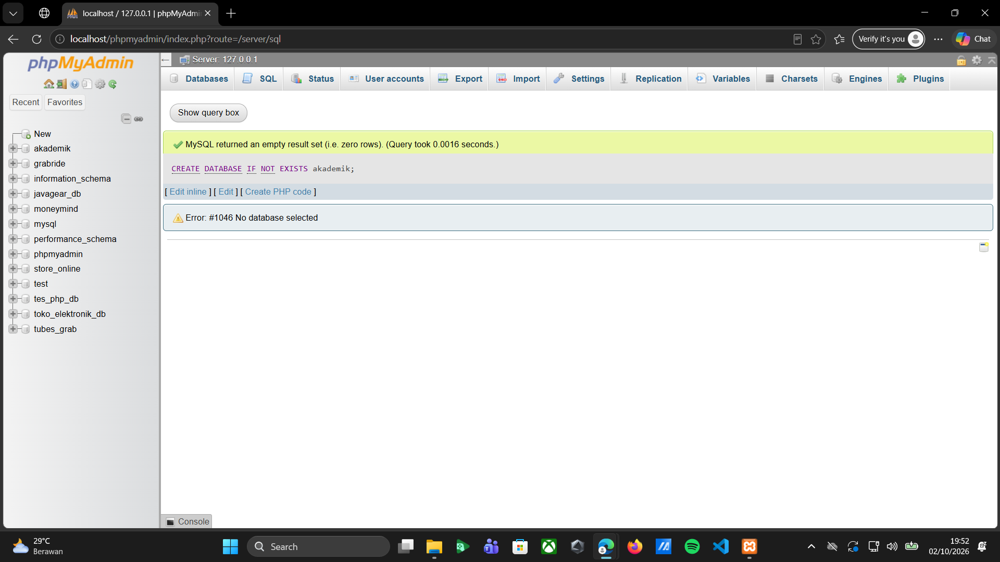
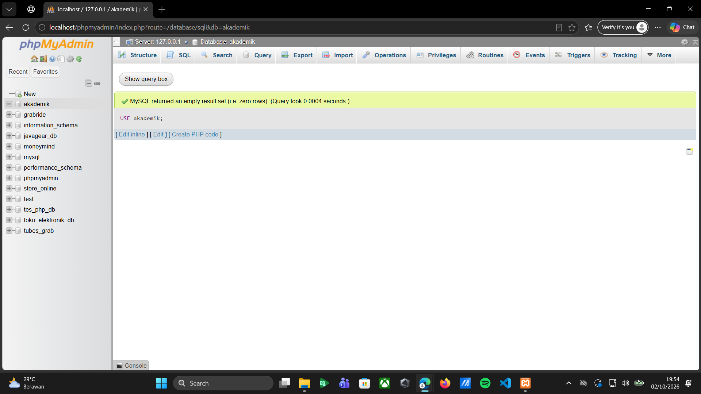
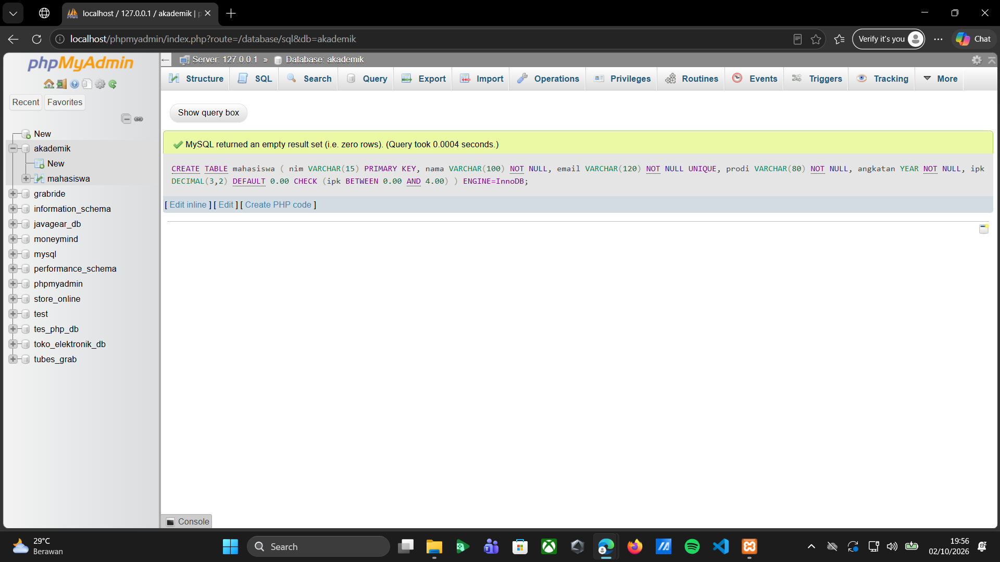
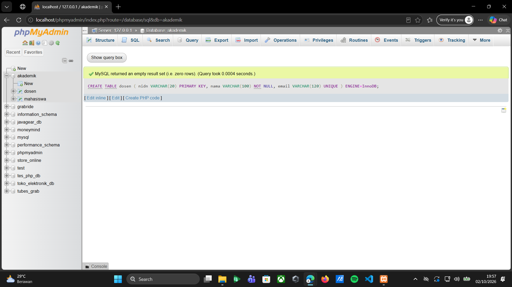
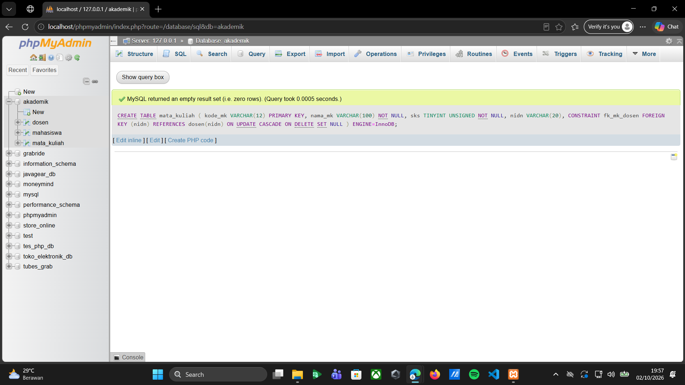
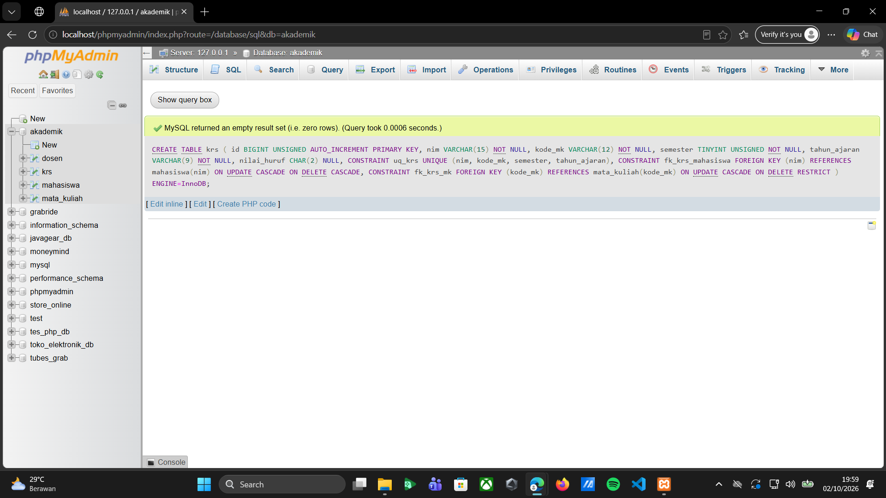
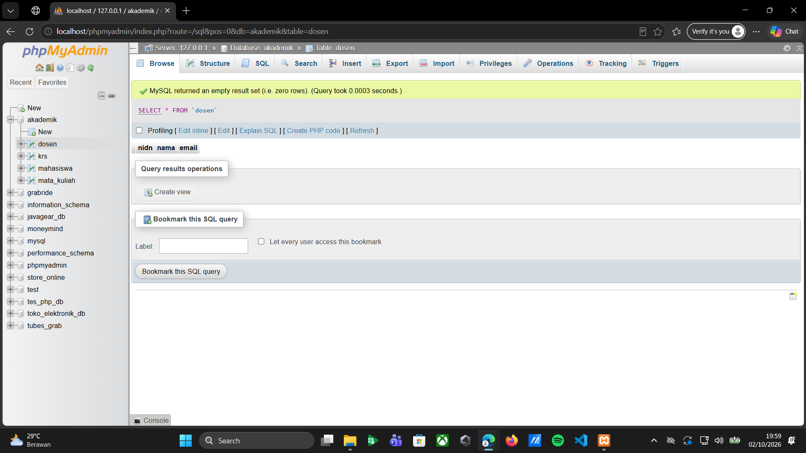
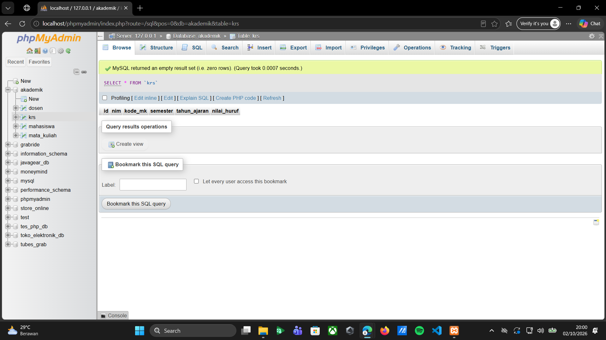
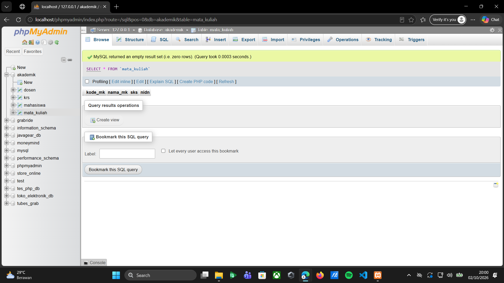
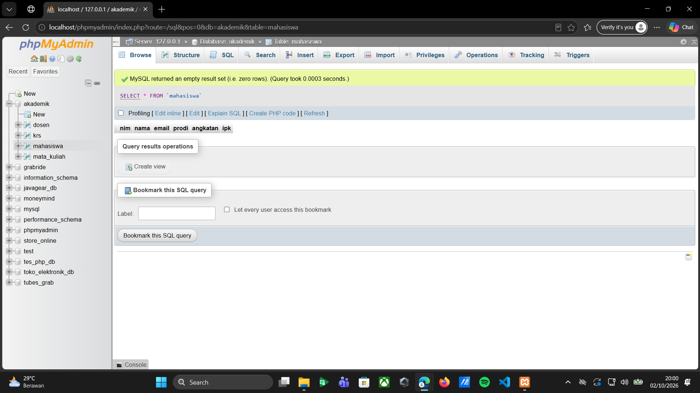

**Tugas 03 - Prak. Pemrograman Berbasis Web - B**

Pada tugas Pertemuan 03 bagian Latihan-01, dilakukan praktik pembuatan database menggunakan phpMyAdmin. Database yang dibuat bernama akademik dan digunakan untuk menyimpan data yang berhubungan dengan kegiatan akademik. Setelah database berhasil dibuat, beberapa tabel dibuat di dalamnya, yaitu tabel mahasiswa, dosen, mata_kuliah, dan krs. Setiap tabel memiliki fungsi masing-masing dan beberapa tabel dibuat saling berhubungan menggunakan primary key dan foreign key.

**Membuat Database Akademik**

Database akademik dibuat menggunakan perintah CREATE DATABASE IF NOT EXISTS akademik;. Perintah tersebut digunakan untuk membuat database baru dan memastikan database dengan nama yang sama tidak dibuat kembali jika sudah tersedia. Setelah perintah berhasil dijalankan, database akademik muncul pada bagian daftar database di sebelah kiri phpMyAdmin. Database ini menjadi tempat untuk menyimpan tabel-tabel yang digunakan dalam tugas.

*Screenshot Membuat Database Akademik:*

**Menampilkan Database Akademik**

Database akademik kemudian dipilih menggunakan perintah USE akademik;. Perintah ini digunakan agar proses pembuatan tabel selanjutnya dilakukan di dalam database akademik. Setelah database dipilih, pada bagian atas phpMyAdmin terlihat keterangan bahwa database yang sedang digunakan adalah akademik.

*Screenshot Menampilkan Database Akademik:*

**Membuat Tabel Mahasiswa**

Tabel mahasiswa dibuat untuk menyimpan data mahasiswa. Beberapa kolom yang digunakan yaitu nim, nama, email, prodi, angkatan, dan ipk. Kolom nim digunakan sebagai primary key sehingga setiap mahasiswa mempunyai identitas yang berbeda. Kolom email dibuat UNIQUE agar tidak ada email yang sama. Pada kolom ipk juga diberikan aturan agar nilai yang dimasukkan berada pada rentang 0 sampai 4.

*Screenshot Membuat Tabel Mahasiswa:*

**Membuat Tabel Dosen**

Tabel dosen digunakan untuk menyimpan data dosen. Tabel ini memiliki kolom nidn, nama, dan email. Kolom nidn digunakan sebagai primary key, sedangkan kolom email diberikan aturan UNIQUE. Data dosen yang tersimpan pada tabel ini nantinya dapat digunakan untuk membuat hubungan dengan tabel mata kuliah.

*Screenshot Membuat Tabel Dosen:*

**Membuat Tabel Mata Kuliah**

Tabel mata_kuliah digunakan untuk menyimpan informasi mengenai mata kuliah. Kolom yang terdapat pada tabel ini yaitu kode_mk, nama_mk, sks, dan nidn. Kolom kode_mk digunakan sebagai primary key. Sementara itu, kolom nidn digunakan sebagai foreign key yang terhubung dengan tabel dosen. Hubungan tersebut digunakan untuk menghubungkan mata kuliah dengan dosen yang mengampunya.

*Screenshot Membuat Tabel Mata Kuliah:*

**Membuat Tabel KRS**

Tabel krs digunakan untuk menyimpan data Kartu Rencana Studi. Tabel ini memiliki kolom id, nim, kode_mk, semester, tahun_ajaran, dan nilai_huruf. Kolom id digunakan sebagai primary key dengan AUTO_INCREMENT. Kolom nim terhubung dengan tabel mahasiswa, sedangkan kode_mk terhubung dengan tabel mata kuliah. Dengan adanya hubungan tersebut, data KRS dapat dikaitkan dengan mahasiswa dan mata kuliah yang diambil.

*Screenshot Membuat Tabel KRS:*

**Menampilkan Data Tabel Dosen**

Perintah SELECT * FROM dosen; digunakan untuk menampilkan seluruh isi tabel dosen. Hasil yang ditampilkan menunjukkan kolom nidn, nama, dan email. Pada tahap ini tabel masih kosong karena belum terdapat data dosen yang dimasukkan. Tampilan tersebut menunjukkan bahwa tabel dosen sudah berhasil dibuat dan dapat digunakan.

*Screenshot Menampilkan Data Tabel Dosen:*

**Menampilkan Data Tabel KRS**

Perintah SELECT * FROM krs; digunakan untuk melihat seluruh data yang terdapat pada tabel KRS. Hasilnya menampilkan kolom id, nim, kode_mk, semester, tahun_ajaran, dan nilai_huruf. Tabel masih kosong karena belum dilakukan proses input data KRS.

*Screenshot Menampilkan Data Tabel KRS:*

**Menampilkan Data Tabel Mahasiswa**

Perintah SELECT * FROM mahasiswa; digunakan untuk menampilkan seluruh isi tabel mahasiswa. Kolom yang ditampilkan terdiri dari nim, nama, email, prodi, angkatan, dan ipk. Hasil yang terlihat masih kosong karena data mahasiswa belum dimasukkan ke dalam tabel.

*Screenshot Menampilkan Data Tabel Mahasiswa:*

**Menampilkan Data Tabel Mata Kuliah**

Perintah SELECT * FROM mata_kuliah; digunakan untuk menampilkan seluruh isi tabel mata kuliah. Kolom yang ditampilkan yaitu kode_mk, nama_mk, sks, dan nidn. Hasilnya masih kosong karena belum ada data mata kuliah yang dimasukkan. Meskipun begitu, struktur tabel sudah berhasil dibuat dan hubungan dengan tabel dosen sudah ditentukan.

*Screenshot Menampilkan Data Tabel Mata Kuliah:*

**Kesimpulan**

Praktik Pertemuan 03 menghasilkan sebuah database akademik yang memiliki beberapa tabel, yaitu mahasiswa, dosen, mata_kuliah, dan krs. Setiap tabel memiliki fungsi yang berbeda dan beberapa tabel saling berhubungan melalui primary key dan foreign key. Perintah SELECT * juga digunakan untuk mengecek tabel yang sudah dibuat. Dari praktik ini dapat dipahami dasar pembuatan database, pembuatan tabel, penggunaan primary key dan foreign key, serta cara mengecek tabel melalui phpMyAdmin.
