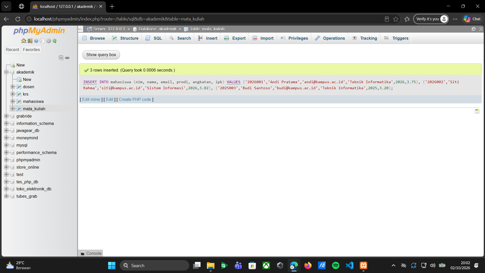
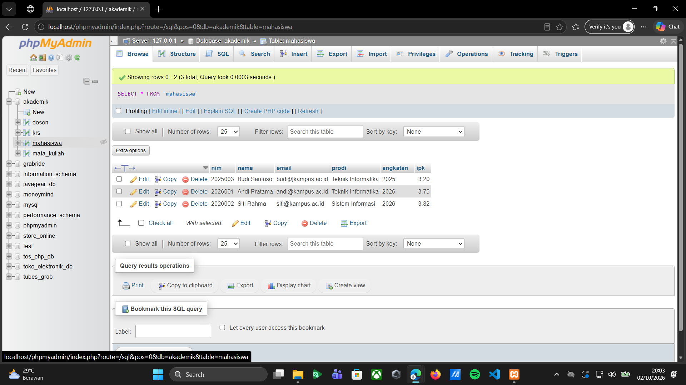
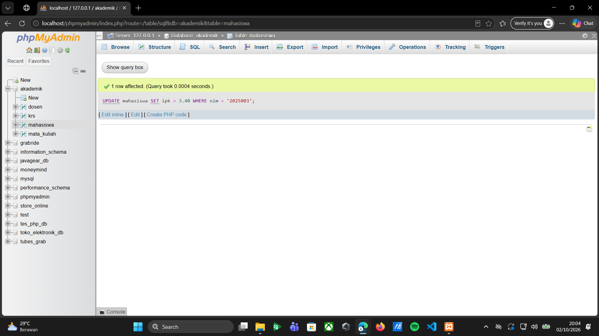
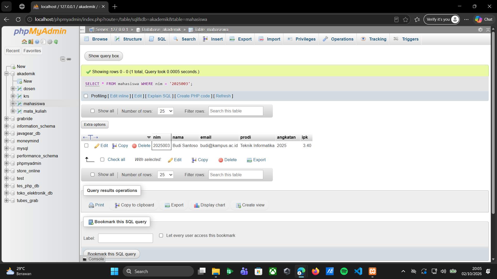
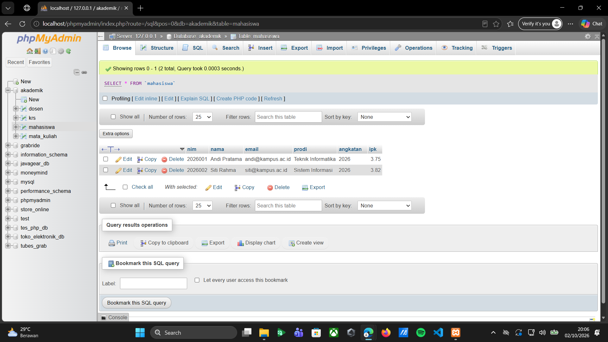

**Tugas 03 - Prak. Pemrograman Berbasis Web - B**

**Latihan-01**

Pada tugas Pertemuan 03 bagian Latihan-01, dilakukan praktik pembuatan database menggunakan phpMyAdmin. Database yang dibuat bernama akademik dan digunakan untuk menyimpan data yang berhubungan dengan kegiatan akademik. Setelah database berhasil dibuat, beberapa tabel dibuat di dalamnya, yaitu tabel mahasiswa, dosen, mata_kuliah, dan krs. Setiap tabel memiliki fungsi masing-masing dan beberapa tabel dibuat saling berhubungan menggunakan primary key dan foreign key.

**Membuat Database Akademik**

Database akademik dibuat menggunakan perintah CREATE DATABASE IF NOT EXISTS akademik;. Perintah tersebut digunakan untuk membuat database baru dan memastikan database dengan nama yang sama tidak dibuat kembali jika sudah tersedia. Setelah perintah berhasil dijalankan, database akademik muncul pada bagian daftar database di sebelah kiri phpMyAdmin. Database ini menjadi tempat untuk menyimpan tabel-tabel yang digunakan dalam tugas.

*Screenshot Membuat Database Akademik:*

**Menampilkan Database Akademik**

Database akademik kemudian dipilih menggunakan perintah USE akademik;. Perintah ini digunakan agar proses pembuatan tabel selanjutnya dilakukan di dalam database akademik. Setelah database dipilih, pada bagian atas phpMyAdmin terlihat keterangan bahwa database yang sedang digunakan adalah akademik.

*Screenshot Menampilkan Database Akademik:*

**Membuat Tabel Mahasiswa**

Tabel mahasiswa dibuat untuk menyimpan data mahasiswa. Beberapa kolom yang digunakan yaitu nim, nama, email, prodi, angkatan, dan ipk. Kolom nim digunakan sebagai primary key sehingga setiap mahasiswa mempunyai identitas yang berbeda. Kolom email dibuat UNIQUE agar tidak ada email yang sama. Pada kolom ipk juga diberikan aturan agar nilai yang dimasukkan berada pada rentang 0 sampai 4.

*Screenshot Membuat Tabel Mahasiswa:*

**Membuat Tabel Dosen**

Tabel dosen digunakan untuk menyimpan data dosen. Tabel ini memiliki kolom nidn, nama, dan email. Kolom nidn digunakan sebagai primary key, sedangkan kolom email diberikan aturan UNIQUE. Data dosen yang tersimpan pada tabel ini nantinya dapat digunakan untuk membuat hubungan dengan tabel mata kuliah.

*Screenshot Membuat Tabel Dosen:*

**Membuat Tabel Mata Kuliah**

Tabel mata_kuliah digunakan untuk menyimpan informasi mengenai mata kuliah. Kolom yang terdapat pada tabel ini yaitu kode_mk, nama_mk, sks, dan nidn. Kolom kode_mk digunakan sebagai primary key. Sementara itu, kolom nidn digunakan sebagai foreign key yang terhubung dengan tabel dosen. Hubungan tersebut digunakan untuk menghubungkan mata kuliah dengan dosen yang mengampunya.

*Screenshot Membuat Tabel Mata Kuliah:*

**Membuat Tabel KRS**

Tabel krs digunakan untuk menyimpan data Kartu Rencana Studi. Tabel ini memiliki kolom id, nim, kode_mk, semester, tahun_ajaran, dan nilai_huruf. Kolom id digunakan sebagai primary key dengan AUTO_INCREMENT. Kolom nim terhubung dengan tabel mahasiswa, sedangkan kode_mk terhubung dengan tabel mata kuliah. Dengan adanya hubungan tersebut, data KRS dapat dikaitkan dengan mahasiswa dan mata kuliah yang diambil.

*Screenshot Membuat Tabel KRS:*

**Menampilkan Data Tabel Dosen**

Perintah SELECT * FROM dosen; digunakan untuk menampilkan seluruh isi tabel dosen. Hasil yang ditampilkan menunjukkan kolom nidn, nama, dan email. Pada tahap ini tabel masih kosong karena belum terdapat data dosen yang dimasukkan. Tampilan tersebut menunjukkan bahwa tabel dosen sudah berhasil dibuat dan dapat digunakan.

*Screenshot Menampilkan Data Tabel Dosen:*

**Menampilkan Data Tabel KRS**

Perintah SELECT * FROM krs; digunakan untuk melihat seluruh data yang terdapat pada tabel KRS. Hasilnya menampilkan kolom id, nim, kode_mk, semester, tahun_ajaran, dan nilai_huruf. Tabel masih kosong karena belum dilakukan proses input data KRS.

*Screenshot Menampilkan Data Tabel KRS:*

**Menampilkan Data Tabel Mahasiswa**

Perintah SELECT * FROM mahasiswa; digunakan untuk menampilkan seluruh isi tabel mahasiswa. Kolom yang ditampilkan terdiri dari nim, nama, email, prodi, angkatan, dan ipk. Hasil yang terlihat masih kosong karena data mahasiswa belum dimasukkan ke dalam tabel.

*Screenshot Menampilkan Data Tabel Mahasiswa:*

**Menampilkan Data Tabel Mata Kuliah**

Perintah SELECT * FROM mata_kuliah; digunakan untuk menampilkan seluruh isi tabel mata kuliah. Kolom yang ditampilkan yaitu kode_mk, nama_mk, sks, dan nidn. Hasilnya masih kosong karena belum ada data mata kuliah yang dimasukkan. Meskipun begitu, struktur tabel sudah berhasil dibuat dan hubungan dengan tabel dosen sudah ditentukan.

*Screenshot Menampilkan Data Tabel Mata Kuliah:*

**Kesimpulan Latihan-01**

Praktik Pertemuan 03 menghasilkan sebuah database akademik yang memiliki beberapa tabel, yaitu mahasiswa, dosen, mata_kuliah, dan krs. Setiap tabel memiliki fungsi yang berbeda dan beberapa tabel saling berhubungan melalui primary key dan foreign key. Perintah SELECT * juga digunakan untuk mengecek tabel yang sudah dibuat. Dari praktik ini dapat dipahami dasar pembuatan database, pembuatan tabel, penggunaan primary key dan foreign key, serta cara mengecek tabel melalui phpMyAdmin.

**Latihan-02**

Pada tugas Pertemuan 03 bagian Latihan-02, dilakukan praktik pengolahan data menggunakan perintah SQL pada phpMyAdmin. Database yang digunakan adalah akademik, dengan tabel mahasiswa sebagai objek utama dalam praktik ini. Kegiatan yang dilakukan meliputi memilih database, menambahkan data mahasiswa, menampilkan data berdasarkan kondisi tertentu, mengurutkan hasil pencarian, memperbarui data, serta menghitung jumlah mahasiswa dan rata-rata IPK berdasarkan program studi. Melalui latihan ini, saya mempelajari penggunaan beberapa perintah SQL untuk mengelola dan menampilkan data sesuai dengan kebutuhan.

**Memilih Database Akademik**

Pada langkah pertama, database akademik dipilih menggunakan perintah USE akademik;. Perintah ini digunakan untuk menentukan database yang akan digunakan dalam proses pengolahan data. Di dalam database tersebut terdapat beberapa tabel, yaitu dosen, krs, mahasiswa, dan mata_kuliah. Setelah perintah berhasil dijalankan, database akademik siap digunakan untuk menjalankan perintah SQL selanjutnya.

*Screenshot Memilih Database Akademik:*

**Menambahkan Data Mahasiswa**

Pada langkah kedua, dilakukan penambahan tiga data mahasiswa ke dalam tabel mahasiswa menggunakan perintah INSERT INTO. Data yang dimasukkan terdiri dari NIM, nama, email, program studi, angkatan, dan IPK. Ketiga data tersebut adalah Andi Pratama, Siti Rahma, dan Budi Santoso. Setelah perintah dijalankan, phpMyAdmin menampilkan keterangan bahwa tiga baris data berhasil ditambahkan ke dalam tabel mahasiswa.

*Screenshot Menambahkan Data Mahasiswa:*

**Menampilkan Data Mahasiswa Berdasarkan IPK**

Pada langkah ketiga, digunakan perintah SELECT untuk menampilkan NIM, nama, program studi, dan IPK mahasiswa yang memiliki IPK lebih besar atau sama dengan 3,50. Perintah WHERE ipk >= 3.50 digunakan untuk menentukan kondisi pencarian. Selanjutnya, ORDER BY ipk DESC digunakan untuk mengurutkan IPK dari nilai tertinggi ke terendah, sedangkan nama ASC digunakan untuk mengurutkan nama secara alfabetis apabila diperlukan. Perintah LIMIT 10 digunakan untuk membatasi jumlah data yang ditampilkan maksimal sepuluh baris. Hasilnya menunjukkan dua mahasiswa yang memenuhi kondisi tersebut, yaitu Siti Rahma dengan IPK 3,82 dan Andi Pratama dengan IPK 3,75.

*Screenshot Menampilkan Data Mahasiswa Berdasarkan IPK:*

**Menampilkan Seluruh Data Mahasiswa**

Pada langkah keempat, digunakan perintah SELECT * FROM mahasiswa; untuk menampilkan seluruh data yang terdapat pada tabel mahasiswa. Tanda bintang (*) digunakan untuk menampilkan semua kolom dalam tabel. Hasilnya menunjukkan tiga data mahasiswa beserta informasi NIM, nama, email, program studi, angkatan, dan IPK masing-masing. Langkah ini dilakukan untuk memeriksa data yang telah dimasukkan sebelumnya.

*Screenshot Menampilkan Seluruh Data Mahasiswa:*

**Mengubah Data IPK Mahasiswa**

Pada langkah kelima, dilakukan perubahan nilai IPK mahasiswa menggunakan perintah UPDATE. Data yang diubah adalah IPK Budi Santoso dengan NIM 2025003, dari nilai 3,20 menjadi 3,40. Perintah UPDATE mahasiswa SET ipk = 3.40 WHERE nim = '2025003'; digunakan untuk memperbarui nilai IPK pada mahasiswa dengan NIM tersebut. Bagian SET menentukan nilai baru yang akan disimpan, sedangkan WHERE memastikan perubahan hanya dilakukan pada data yang sesuai. Setelah perintah dijalankan, phpMyAdmin menampilkan keterangan bahwa satu baris data berhasil diperbarui.

*Screenshot Mengubah Data IPK Mahasiswa:*

**Memeriksa Hasil Perubahan Data**

Pada langkah keenam, dilakukan pemeriksaan terhadap hasil perubahan data dengan menjalankan kembali perintah SELECT * FROM mahasiswa;. Hasilnya menunjukkan bahwa IPK Budi Santoso telah berubah menjadi 3,40, sedangkan IPK Andi Pratama tetap 3,75 dan Siti Rahma tetap 3,82. Langkah ini dilakukan untuk memastikan bahwa perintah UPDATE telah dijalankan dan perubahan data tersimpan sesuai dengan kondisi yang ditentukan.

*Screenshot Memeriksa Hasil Perubahan Data:*

**Menghitung Jumlah Mahasiswa dan Rata-Rata IPK**

Pada langkah ketujuh, digunakan fungsi agregat COUNT(*) untuk menghitung jumlah mahasiswa dan AVG(ipk) untuk menghitung rata-rata IPK berdasarkan program studi. Perintah GROUP BY prodi digunakan untuk mengelompokkan data berdasarkan program studi, sedangkan ORDER BY jumlah DESC digunakan untuk mengurutkan hasil berdasarkan jumlah mahasiswa dari yang terbanyak. Hasilnya menunjukkan bahwa program studi Teknik Informatika memiliki dua mahasiswa dengan rata-rata IPK 3,58, sedangkan program studi Sistem Informasi memiliki satu mahasiswa dengan rata-rata IPK 3,82. Melalui langkah ini, saya mempelajari cara mengolah data menjadi informasi ringkasan berdasarkan kelompok tertentu.

*Screenshot Menghitung Jumlah Mahasiswa dan Rata-Rata IPK:*

**Menampilkan Data Mahasiswa Berdasarkan NIM**

Pada langkah kedelapan, digunakan perintah SELECT * FROM mahasiswa WHERE nim = '2025003'; untuk mencari dan menampilkan data mahasiswa berdasarkan NIM tertentu. Perintah WHERE berfungsi untuk menentukan kondisi pencarian sehingga hanya data mahasiswa dengan NIM 2025003 yang ditampilkan. Hasilnya menunjukkan informasi Budi Santoso, meliputi email, program studi Teknik Informatika, angkatan 2025, dan IPK 3,40. Langkah ini menunjukkan cara mengambil data tertentu dari tabel berdasarkan identitas mahasiswa.

*Screenshot Menampilkan Data Mahasiswa Berdasarkan NIM:*

**Memeriksa Data Mahasiswa**

Pada langkah kesembilan, tabel mahasiswa ditampilkan kembali menggunakan perintah SELECT * FROM mahasiswa;. Berdasarkan screenshot, hasil yang terlihat hanya menampilkan data Andi Pratama dan Siti Rahma, sehingga jumlah data yang ditampilkan berbeda dari hasil sebelumnya. Penyebab perubahan jumlah data tersebut perlu diperiksa kembali melalui riwayat perintah SQL yang dijalankan. Langkah ini menjadi bagian dari pemeriksaan data untuk memastikan isi tabel sesuai dengan kondisi database yang digunakan.

*Screenshot Memeriksa Data Mahasiswa:*

**Kesimpulan Latihan-02**

Berdasarkan praktik Latihan-02 pada Pertemuan 03, saya mempelajari cara menggunakan perintah SQL melalui phpMyAdmin untuk mengelola data mahasiswa dalam database akademik. Perintah yang dipraktikkan meliputi USE, INSERT INTO, SELECT, WHERE, ORDER BY, LIMIT, UPDATE, COUNT, AVG, dan GROUP BY. Setiap perintah memiliki kegunaan masing-masing, mulai dari memilih database, menambahkan data, menampilkan data berdasarkan kondisi, memperbarui informasi, hingga menghitung jumlah mahasiswa dan rata-rata IPK berdasarkan program studi. Melalui latihan ini, saya dapat memahami penerapan perintah SQL secara langsung serta mengetahui pentingnya memeriksa hasil setiap operasi agar data yang tersimpan sesuai dengan kebutuhan.
