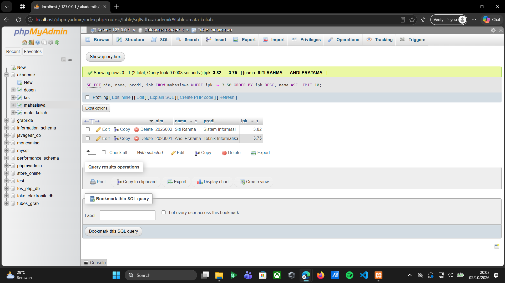
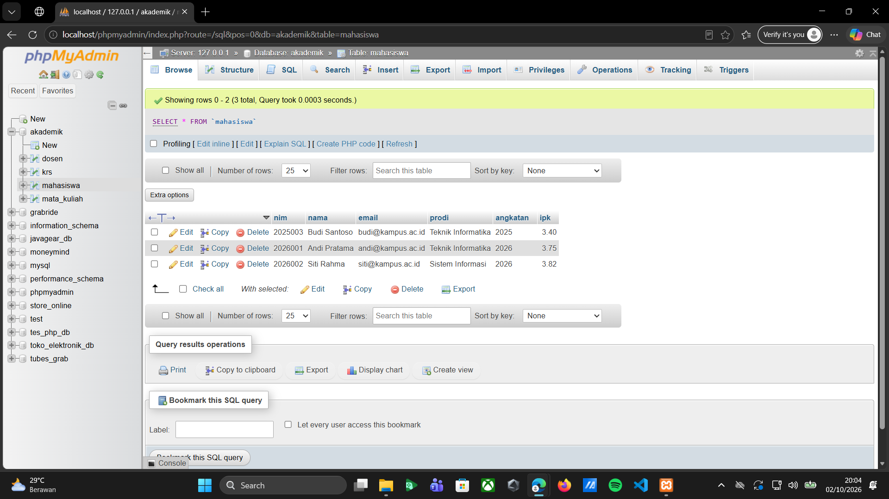
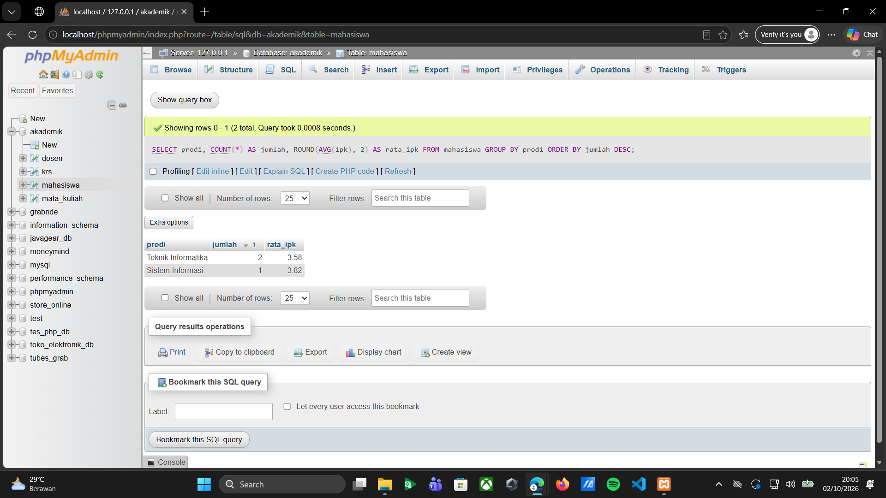

**Tugas 04 - Prak. Pemrograman Berbasis Web - B**

Pada tugas Pertemuan 03 bagian Latihan-02, dilakukan praktik pengolahan data menggunakan perintah SQL pada phpMyAdmin. Database yang digunakan adalah akademik, dengan tabel mahasiswa sebagai objek utama dalam praktik ini. Kegiatan yang dilakukan meliputi memilih database, menambahkan data mahasiswa, menampilkan data berdasarkan kondisi tertentu, mengurutkan hasil pencarian, memperbarui data, serta menghitung jumlah mahasiswa dan rata-rata IPK berdasarkan program studi. Melalui latihan ini, saya mempelajari penggunaan beberapa perintah SQL untuk mengelola dan menampilkan data sesuai dengan kebutuhan.

**Memilih Database Akademik**

Pada langkah pertama, database akademik dipilih menggunakan perintah USE akademik;. Perintah ini digunakan untuk menentukan database yang akan digunakan dalam proses pengolahan data. Di dalam database tersebut terdapat beberapa tabel, yaitu dosen, krs, mahasiswa, dan mata_kuliah. Setelah perintah berhasil dijalankan, database akademik siap digunakan untuk menjalankan perintah SQL selanjutnya.

*Screenshot Memilih Database Akademik:*

**Menambahkan Data Mahasiswa**

Pada langkah kedua, dilakukan penambahan tiga data mahasiswa ke dalam tabel mahasiswa menggunakan perintah INSERT INTO. Data yang dimasukkan terdiri dari NIM, nama, email, program studi, angkatan, dan IPK. Ketiga data tersebut adalah Andi Pratama, Siti Rahma, dan Budi Santoso. Setelah perintah dijalankan, phpMyAdmin menampilkan keterangan bahwa tiga baris data berhasil ditambahkan ke dalam tabel mahasiswa.

*Screenshot Menambahkan Data Mahasiswa:*

**Menampilkan Data Mahasiswa Berdasarkan IPK**

Pada langkah ketiga, digunakan perintah SELECT untuk menampilkan NIM, nama, program studi, dan IPK mahasiswa yang memiliki IPK lebih besar atau sama dengan 3,50. Perintah WHERE ipk >= 3.50 digunakan untuk menentukan kondisi pencarian. Selanjutnya, ORDER BY ipk DESC digunakan untuk mengurutkan IPK dari nilai tertinggi ke terendah, sedangkan nama ASC digunakan untuk mengurutkan nama secara alfabetis apabila diperlukan. Perintah LIMIT 10 digunakan untuk membatasi jumlah data yang ditampilkan maksimal sepuluh baris. Hasilnya menunjukkan dua mahasiswa yang memenuhi kondisi tersebut, yaitu Siti Rahma dengan IPK 3,82 dan Andi Pratama dengan IPK 3,75.

*Screenshot Menampilkan Data Mahasiswa Berdasarkan IPK:*

**Menampilkan Seluruh Data Mahasiswa**

Pada langkah keempat, digunakan perintah SELECT * FROM mahasiswa; untuk menampilkan seluruh data yang terdapat pada tabel mahasiswa. Tanda bintang (*) digunakan untuk menampilkan semua kolom dalam tabel. Hasilnya menunjukkan tiga data mahasiswa beserta informasi NIM, nama, email, program studi, angkatan, dan IPK masing-masing. Langkah ini dilakukan untuk memeriksa data yang telah dimasukkan sebelumnya.

*Screenshot Menampilkan Seluruh Data Mahasiswa:*

**Mengubah Data IPK Mahasiswa**

Pada langkah kelima, dilakukan perubahan nilai IPK mahasiswa menggunakan perintah UPDATE. Data yang diubah adalah IPK Budi Santoso dengan NIM 2025003, dari nilai 3,20 menjadi 3,40. Perintah UPDATE mahasiswa SET ipk = 3.40 WHERE nim = '2025003'; digunakan untuk memperbarui nilai IPK pada mahasiswa dengan NIM tersebut. Bagian SET menentukan nilai baru yang akan disimpan, sedangkan WHERE memastikan perubahan hanya dilakukan pada data yang sesuai. Setelah perintah dijalankan, phpMyAdmin menampilkan keterangan bahwa satu baris data berhasil diperbarui.

*Screenshot Mengubah Data IPK Mahasiswa:*

**Memeriksa Hasil Perubahan Data**

Pada langkah keenam, dilakukan pemeriksaan terhadap hasil perubahan data dengan menjalankan kembali perintah SELECT * FROM mahasiswa;. Hasilnya menunjukkan bahwa IPK Budi Santoso telah berubah menjadi 3,40, sedangkan IPK Andi Pratama tetap 3,75 dan Siti Rahma tetap 3,82. Langkah ini dilakukan untuk memastikan bahwa perintah UPDATE telah dijalankan dan perubahan data tersimpan sesuai dengan kondisi yang ditentukan.

*Screenshot Memeriksa Hasil Perubahan Data:*

**Menghitung Jumlah Mahasiswa dan Rata-Rata IPK**

Pada langkah ketujuh, digunakan fungsi agregat COUNT(*) untuk menghitung jumlah mahasiswa dan AVG(ipk) untuk menghitung rata-rata IPK berdasarkan program studi. Perintah GROUP BY prodi digunakan untuk mengelompokkan data berdasarkan program studi, sedangkan ORDER BY jumlah DESC digunakan untuk mengurutkan hasil berdasarkan jumlah mahasiswa dari yang terbanyak. Hasilnya menunjukkan bahwa program studi Teknik Informatika memiliki dua mahasiswa dengan rata-rata IPK 3,58, sedangkan program studi Sistem Informasi memiliki satu mahasiswa dengan rata-rata IPK 3,82. Melalui langkah ini, saya mempelajari cara mengolah data menjadi informasi ringkasan berdasarkan kelompok tertentu.

*Screenshot Menghitung Jumlah Mahasiswa dan Rata-Rata IPK:*

**Menampilkan Data Mahasiswa Berdasarkan NIM**

Pada langkah kedelapan, digunakan perintah SELECT * FROM mahasiswa WHERE nim = '2025003'; untuk mencari dan menampilkan data mahasiswa berdasarkan NIM tertentu. Perintah WHERE berfungsi untuk menentukan kondisi pencarian sehingga hanya data mahasiswa dengan NIM 2025003 yang ditampilkan. Hasilnya menunjukkan informasi Budi Santoso, meliputi email, program studi Teknik Informatika, angkatan 2025, dan IPK 3,40. Langkah ini menunjukkan cara mengambil data tertentu dari tabel berdasarkan identitas mahasiswa.

*Screenshot Menampilkan Data Mahasiswa Berdasarkan NIM:*

**Memeriksa Data Mahasiswa**

Pada langkah kesembilan, tabel mahasiswa ditampilkan kembali menggunakan perintah SELECT * FROM mahasiswa;. Berdasarkan screenshot, hasil yang terlihat hanya menampilkan data Andi Pratama dan Siti Rahma, sehingga jumlah data yang ditampilkan berbeda dari hasil sebelumnya. Penyebab perubahan jumlah data tersebut perlu diperiksa kembali melalui riwayat perintah SQL yang dijalankan. Langkah ini menjadi bagian dari pemeriksaan data untuk memastikan isi tabel sesuai dengan kondisi database yang digunakan.

*Screenshot Memeriksa Data Mahasiswa:*

**Kesimpulan**

Berdasarkan praktik Latihan-02 pada Pertemuan 03, saya mempelajari cara menggunakan perintah SQL melalui phpMyAdmin untuk mengelola data mahasiswa dalam database akademik. Perintah yang dipraktikkan meliputi USE, INSERT INTO, SELECT, WHERE, ORDER BY, LIMIT, UPDATE, COUNT, AVG, dan GROUP BY. Setiap perintah memiliki kegunaan masing-masing, mulai dari memilih database, menambahkan data, menampilkan data berdasarkan kondisi, memperbarui informasi, hingga menghitung jumlah mahasiswa dan rata-rata IPK berdasarkan program studi. Melalui latihan ini, saya dapat memahami penerapan perintah SQL secara langsung serta mengetahui pentingnya memeriksa hasil setiap operasi agar data yang tersimpan sesuai dengan kebutuhan.
